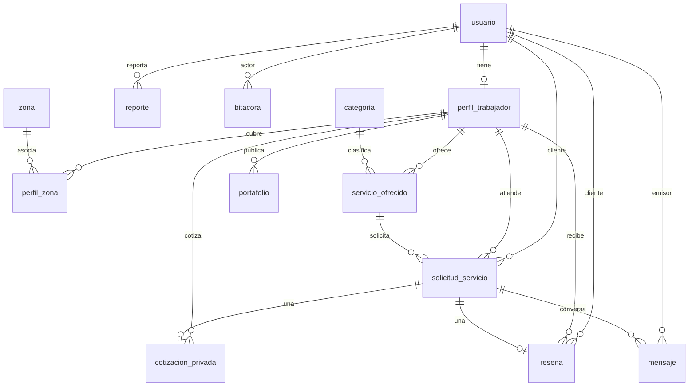

# Documentación técnica — Modelo de datos inicial

**Proyecto:** OficiosYa  
**Motor:** PostgreSQL (Supabase, esquema `public`)  
**Fecha:** 23 de septiembre de 2026  
**Alcance:** tablas, campos, tipos, restricciones y llaves (PK/FK) del modelo inicial.

El modelo cubre usuarios, perfiles de trabajador, cobertura geográfica, catálogo de servicios, solicitudes, cotización privada, mensajería, reseñas, portafolio, reportes y bitácora.

---

## 1. Convenciones

| Convención | Criterio |
|---|---|
| Identificadores | `integer GENERATED ALWAYS AS IDENTITY` (no se insertan a mano) |
| PK compuesta | Solo `perfil_zona (id_perfil, id_zona)` |
| Timestamps | `timestamp without time zone`, default `CURRENT_TIMESTAMP` |
| Textos cortos | `varchar(n)` con tope documentado |
| Textos largos | `text` |
| Estados | `varchar(30)` + `CHECK` |
| Booleanos | `boolean` con default |
| Nombres | español, `id_*` para llaves |
| `id_trabajador` | En solicitudes, cotizaciones y reseñas apunta a `perfil_trabajador.id_perfil`, no a `usuario.id_usuario` |

`NOT NULL` se marca cuando la columna es obligatoria en el esquema. El resto admite `NULL`.

---

El poster del ERD conceptual y físico está en [`01_Diagrama_Entidad_Relacion_ERD_Conceptual_y_Fisico.png`](01_Diagrama_Entidad_Relacion_ERD_Conceptual_y_Fisico.png) y en [PDF](01_Diagrama_Entidad_Relacion_ERD_Conceptual_y_Fisico.pdf).

## 2. Diagrama entidad-relación



---

## 3. Catálogo de tablas

### 3.1 `usuario`

Información de cuenta. El modo cliente/trabajador se resuelve en aplicación (`modo_activo` + existencia de `perfil_trabajador`).

| Campo | Tipo | Nulo | Default | Restricción |
|---|---|---|---|---|
| `id_usuario` | `integer` identity | No | identity | **PK** |
| `nombre` | `varchar(150)` | No | — | |
| `correo` | `varchar(150)` | No | — | **UNIQUE** `uq_usuario_correo` |
| `telefono` | `varchar(20)` | Sí | — | |
| `password_hash` | `varchar(255)` | No | — | No exponer en API |
| `modo_activo` | `boolean` | No | `true` | Cuenta operable |
| `estado` | `varchar(30)` | No | `'ACTIVO'` | **CHECK** `chk_usuario_estado` |

**Valores de `estado`:** `ACTIVO`, `INACTIVO`, `SUSPENDIDO`, `ELIMINADO`.

---

### 3.2 `perfil_trabajador`

Un usuario tiene como máximo un perfil profesional.

| Campo | Tipo | Nulo | Default | Restricción |
|---|---|---|---|---|
| `id_perfil` | `integer` identity | No | identity | **PK** |
| `id_usuario` | `integer` | No | — | **FK → `usuario.id_usuario`**, **UNIQUE** `uq_perfil_usuario` |
| `oficio_principal` | `varchar(150)` | No | — | |
| `descripcion` | `text` | Sí | — | Texto libre o JSON embebido (ver §5) |
| `experiencia` | `varchar(100)` | Sí | — | |
| `disponibilidad` | `varchar(100)` | Sí | — | En API: `Disponible` / `Ocupado` |
| `contacto_visible` | `boolean` | No | `true` | |
| `verificado` | `boolean` | No | `false` | |
| `reputacion_promedio` | `numeric(3,2)` | No | `0` | Cache del promedio de reseñas |
| `total_resenas` | `integer` | No | `0` | Cache del conteo de reseñas |

---

### 3.3 `zona`

Catálogo geográfico. No guarda latitud/longitud; las coordenadas de búsqueda viven en aplicación.

| Campo | Tipo | Nulo | Default | Restricción |
|---|---|---|---|---|
| `id_zona` | `integer` identity | No | identity | **PK** |
| `nombre` | `varchar(100)` | No | — | **UNIQUE** `uq_zona_nombre` |
| `tipo` | `varchar(50)` | No | — | Ej. cuadrante, municipio, departamento, zona |
| `estado` | `varchar(30)` | No | `'ACTIVA'` | **CHECK** `chk_zona_estado`: `ACTIVA`, `INACTIVA` |

---

### 3.4 `perfil_zona`

Cobertura del trabajador. La PK compuesta impide duplicar el par perfil-zona.

| Campo | Tipo | Nulo | Default | Restricción |
|---|---|---|---|---|
| `id_perfil` | `integer` | No | — | **PK** + **FK → `perfil_trabajador.id_perfil`** |
| `id_zona` | `integer` | No | — | **PK** + **FK → `zona.id_zona`** |

---

### 3.5 `categoria`

| Campo | Tipo | Nulo | Default | Restricción |
|---|---|---|---|---|
| `id_categoria` | `integer` identity | No | identity | **PK** |
| `nombre` | `varchar(100)` | No | — | **UNIQUE** `uq_categoria_nombre` |
| `estado` | `varchar(30)` | No | `'ACTIVA'` | `ACTIVA`, `INACTIVA` |

---

### 3.6 `servicio_ofrecido`

Oferta del trabajador. El precio público no se guarda aquí; la cotización es privada.

| Campo | Tipo | Nulo | Default | Restricción |
|---|---|---|---|---|
| `id_servicio` | `integer` identity | No | identity | **PK** |
| `id_perfil` | `integer` | No | — | **FK → `perfil_trabajador.id_perfil`** |
| `id_categoria` | `integer` | No | — | **FK → `categoria.id_categoria`** |
| `nombre` | `varchar(150)` | No | — | |
| `descripcion` | `text` | Sí | — | |
| `activo` | `boolean` | No | `true` | |

---

### 3.7 `solicitud_servicio`

Pedido del cliente a un trabajador y a uno de sus servicios.

| Campo | Tipo | Nulo | Default | Restricción |
|---|---|---|---|---|
| `id_solicitud` | `integer` identity | No | identity | **PK** |
| `id_cliente` | `integer` | No | — | **FK → `usuario.id_usuario`** |
| `id_trabajador` | `integer` | No | — | **FK → `perfil_trabajador.id_perfil`** |
| `id_servicio` | `integer` | No | — | **FK → `servicio_ofrecido.id_servicio`** |
| `descripcion` | `text` | No | — | |
| `ubicacion_aprox` | `varchar(255)` | Sí | — | |
| `fecha_deseada` | `timestamp` | Sí | — | |
| `estado` | `varchar(30)` | No | `'PENDIENTE'` | **CHECK** `chk_solicitud_estado` |
| `urgente` | `boolean` | No | `false` | |

**Valores de `estado` (CHECK):**  
`PENDIENTE`, `Enviada`, `Aceptada`, `ACEPTADA`, `EN_PROCESO`, `Rechazada`, `RECHAZADA`, `Cancelada`, `CANCELADA`, `Finalizada`, `FINALIZADA`, `COMPLETADA`.

La API normaliza a: `Enviada`, `Aceptada`, `Rechazada`, `Cancelada`, `Finalizada`.  
`PENDIENTE` se trata como `Enviada`. El trigger `trg_validar_estado_solicitud` solo permite insertar `Enviada`/`PENDIENTE` y los saltos de la máquina de estados (HU-14/HU-15).

---

### 3.8 `cotizacion_privada`

Una solicitud admite una sola cotización en el modelo inicial.

| Campo | Tipo | Nulo | Default | Restricción |
|---|---|---|---|---|
| `id_cotizacion` | `integer` identity | No | identity | **PK** |
| `id_solicitud` | `integer` | No | — | **FK → `solicitud_servicio.id_solicitud`**, **UNIQUE** `uq_cotizacion_solicitud` |
| `id_trabajador` | `integer` | No | — | **FK → `perfil_trabajador.id_perfil`** |
| `monto_estimado` | `numeric` | No | — | |
| `descripcion_alcance` | `text` | No | — | |
| `fecha_emision` | `timestamp` | No | `CURRENT_TIMESTAMP` | |
| `estado` | `varchar(30)` | No | `'PENDIENTE'` | CHECK: `PENDIENTE`, `ACEPTADA`, `RECHAZADA` |

---

### 3.9 `mensaje`

| Campo | Tipo | Nulo | Default | Restricción |
|---|---|---|---|---|
| `id_mensaje` | `integer` identity | No | identity | **PK** |
| `id_solicitud` | `integer` | No | — | **FK → `solicitud_servicio.id_solicitud`** |
| `id_emisor` | `integer` | No | — | **FK → `usuario.id_usuario`** |
| `contenido` | `text` | No | — | |
| `adjunto_url` | `varchar(500)` | Sí | — | |
| `fecha_envio` | `timestamp` | No | `CURRENT_TIMESTAMP` | |

---

### 3.10 `resena`

Una solicitud genera como máximo una reseña.

| Campo | Tipo | Nulo | Default | Restricción |
|---|---|---|---|---|
| `id_resena` | `integer` identity | No | identity | **PK** |
| `id_solicitud` | `integer` | No | — | **FK → `solicitud_servicio.id_solicitud`**, **UNIQUE** `uq_resena_solicitud` |
| `id_cliente` | `integer` | No | — | **FK → `usuario.id_usuario`** |
| `id_trabajador` | `integer` | No | — | **FK → `perfil_trabajador.id_perfil`** |
| `calificacion` | `integer` | No | — | **CHECK** 1–5 |
| `comentario` | `text` | Sí | — | |
| `respuesta` | `text` | Sí | — | Respuesta del trabajador |
| `fecha` | `timestamp` | No | `CURRENT_TIMESTAMP` | |

El trigger `trg_actualizar_promedio_trabajador` (HU-18) actualiza `perfil_trabajador.reputacion_promedio` y `total_resenas`.

---

### 3.11 `portafolio`

| Campo | Tipo | Nulo | Default | Restricción |
|---|---|---|---|---|
| `id_elemento` | `integer` identity | No | identity | **PK** |
| `id_perfil` | `integer` | No | — | **FK → `perfil_trabajador.id_perfil`** |
| `titulo` | `varchar(150)` | No | — | |
| `descripcion` | `text` | Sí | — | |
| `imagen_url` | `varchar(500)` | Sí | — | Ruta o URL (tope 500) |
| `fecha_publicacion` | `timestamp` | No | `CURRENT_TIMESTAMP` | |

---

### 3.12 `reporte`

`id_recurso` es polimórfico según `tipo_recurso`. No lleva FK física.

| Campo | Tipo | Nulo | Default | Restricción |
|---|---|---|---|---|
| `id_reporte` | `integer` identity | No | identity | **PK** |
| `id_usuario_reporta` | `integer` | No | — | **FK → `usuario.id_usuario`** |
| `tipo_recurso` | `varchar(50)` | No | — | |
| `id_recurso` | `integer` | No | — | Sin FK (polimórfico) |
| `motivo` | `text` | No | — | |
| `estado` | `varchar(30)` | No | `'PENDIENTE'` | CHECK: `PENDIENTE`, `RESUELTO`, `RECHAZADO` |
| `fecha` | `timestamp` | No | `CURRENT_TIMESTAMP` | |

---

### 3.13 `bitacora`

| Campo | Tipo | Nulo | Default | Restricción |
|---|---|---|---|---|
| `id_evento` | `integer` identity | No | identity | **PK** |
| `id_actor` | `integer` | No | — | **FK → `usuario.id_usuario`** |
| `accion` | `varchar(100)` | No | — | Ej. `REGISTER`, `CREATE_REQUEST`, `STATUS_ACEPTAR` |
| `recurso` | `varchar(100)` | Sí | — | Tabla o recurso afectado |
| `fecha_hora` | `timestamp` | No | `CURRENT_TIMESTAMP` | |
| `origen` | `varchar(100)` | Sí | — | Módulo de origen (`api/auth`, `api/requests`, …) |

---

## 4. Llaves foráneas (resumen)

| Desde | Columna | Hacia | Cardinalidad |
|---|---|---|---|
| `perfil_trabajador` | `id_usuario` | `usuario.id_usuario` | 1:1 |
| `perfil_zona` | `id_perfil` | `perfil_trabajador.id_perfil` | N:1 |
| `perfil_zona` | `id_zona` | `zona.id_zona` | N:1 |
| `servicio_ofrecido` | `id_perfil` | `perfil_trabajador.id_perfil` | N:1 |
| `servicio_ofrecido` | `id_categoria` | `categoria.id_categoria` | N:1 |
| `portafolio` | `id_perfil` | `perfil_trabajador.id_perfil` | N:1 |
| `solicitud_servicio` | `id_cliente` | `usuario.id_usuario` | N:1 |
| `solicitud_servicio` | `id_trabajador` | `perfil_trabajador.id_perfil` | N:1 |
| `solicitud_servicio` | `id_servicio` | `servicio_ofrecido.id_servicio` | N:1 |
| `cotizacion_privada` | `id_solicitud` | `solicitud_servicio.id_solicitud` | 1:1 |
| `cotizacion_privada` | `id_trabajador` | `perfil_trabajador.id_perfil` | N:1 |
| `mensaje` | `id_solicitud` | `solicitud_servicio.id_solicitud` | N:1 |
| `mensaje` | `id_emisor` | `usuario.id_usuario` | N:1 |
| `resena` | `id_solicitud` | `solicitud_servicio.id_solicitud` | 1:1 |
| `resena` | `id_cliente` | `usuario.id_usuario` | N:1 |
| `resena` | `id_trabajador` | `perfil_trabajador.id_perfil` | N:1 |
| `reporte` | `id_usuario_reporta` | `usuario.id_usuario` | N:1 |
| `bitacora` | `id_actor` | `usuario.id_usuario` | N:1 |

Sin FK física: `reporte.id_recurso`.

---

## 5. JSON embebido en `perfil_trabajador.descripcion`

No hay columnas nativas de tarifas ni horarios. Si `descripcion` es JSON con `"v": 1`, el API lo interpreta así:

```json
{
  "v": 1,
  "bio": "Reparaciones residenciales",
  "tarifas": {
    "tipo": "por_hora",
    "monto_desde": 50,
    "monto_hasta": 120,
    "moneda": "GTQ",
    "notas": "Visita técnica 80"
  },
  "horarios": [
    { "dia": "lunes", "desde": "08:00", "hasta": "17:00" }
  ],
  "reputacion": 4.5,
  "total_resenas": 2
}
```

`tipo` de tarifa: `por_hora` | `por_servicio` | `a_convenir`.  
`dia`: `lunes` … `domingo`.  
Si el texto no es ese JSON, se trata como biografía libre.

---

## 6. Constraints nombrados (verificados)

| Nombre | Tabla | Tipo | Regla |
|---|---|---|---|
| `uq_usuario_correo` | `usuario` | UNIQUE | Un correo por cuenta |
| `chk_usuario_estado` | `usuario` | CHECK | `ACTIVO`, `INACTIVO`, `SUSPENDIDO`, `ELIMINADO` |
| `uq_perfil_usuario` | `perfil_trabajador` | UNIQUE | Un perfil por usuario |
| `uq_zona_nombre` | `zona` | UNIQUE | Nombre de zona único |
| `chk_zona_estado` | `zona` | CHECK | `ACTIVA`, `INACTIVA` |
| `uq_categoria_nombre` | `categoria` | UNIQUE | Nombre de categoría único |
| `chk_solicitud_estado` | `solicitud_servicio` | CHECK | Estados de solicitud (§3.7) |
| `uq_cotizacion_solicitud` | `cotizacion_privada` | UNIQUE | Una cotización por solicitud |
| `uq_resena_solicitud` | `resena` | UNIQUE | Una reseña por solicitud |
| `chk_resena_calificacion` | `resena` | CHECK | `calificacion BETWEEN 1 AND 5` |

PK implícitas: `{tabla}_pkey` (o PK compuesta en `perfil_zona`).

---

## 7. Integridad de negocio (fuera del DDL base)

Scripts opcionales en el repositorio; no cambian el modelo inicial, lo refuerzan:

| Script | Efecto |
|---|---|
| `src/requests/sql/001_maquina_estados_solicitud.sql` | Trigger de transiciones + función `cambiar_estado_solicitud` (`FOR UPDATE`) |
| `src/reviews/sql/001_promedio_calificacion.sql` | Trigger de promedio + columnas de reputación |
| `src/search/sql/001_motor_busqueda_indexada.sql` | Índices, columnas generadas de tarifa y RPC de búsqueda |

---

## 8. Conclusión

El modelo inicial queda en **13 tablas** con PK identity (salvo la PK compuesta `perfil_zona`), FK explícitas entre usuario, perfil, zona, servicio y solicitud, y constraints de unicidad/estado/calificación. La cotización y la reseña son 1:1 con la solicitud. El precio y los horarios no son columnas propias: van en el JSON de `descripcion`. Los reportes usan una referencia polimórfica sin FK. Sobre ese esquema, la API aplica la máquina de estados de solicitudes y el recálculo del promedio de reseñas.
